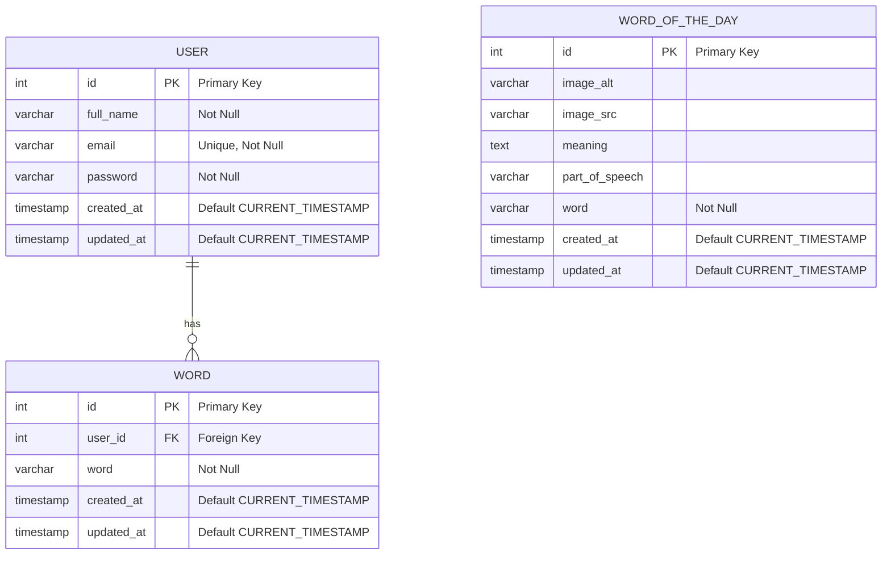

# Online Dictionary

## About the project

Find the words and learn together.

The project aims to help you find unknown words, their definitions and pronunciations. You will be able to save them for future in your profile.

## DB Schema



## Run locally

1. Create and fill all `.env` files, use `.env.example` for reference.
2. Initialize database by running `npm run create-db` on Linux based systems or by running a `./scripts/init_db.sh` script on the Windows machine.
3. Install dependencies: `npm install`
4. Install pre-commit hooks: `npx simple-git-hooks`. This hook is used to verify code style on commit.
5. Build an app: `npm run build`.
6. Start an app: `npm run start`.

Or instead of building a project you can run it in the dev mode: `npm run start:dev`

## Contributing guide

### Pull Request Flow

```
<type>: <ticket-title> <project-prefix>-<issue-number>
```

For the full list of types check [Conventional Commits](https://github.com/conventional-changelog/commitlint/tree/master/%40commitlint/config-conventional)

Examples:

- `feat: add search field od-12`

### Branch Flow

```
<issue-number>-<type>-<short-desc>
```

Examples:

- `12-feat-add-search-field`
- `34-fix-user-profile`

### Commit Flow

We use [Conventional Commits](https://www.conventionalcommits.org/en/v1.0.0) to handle commit messages

```
<type>: <description> <project-prefix>-<issue-number>
```

Examples:

- `feat: update word display od-54`
- `fix: make button text to be bold od-13`
